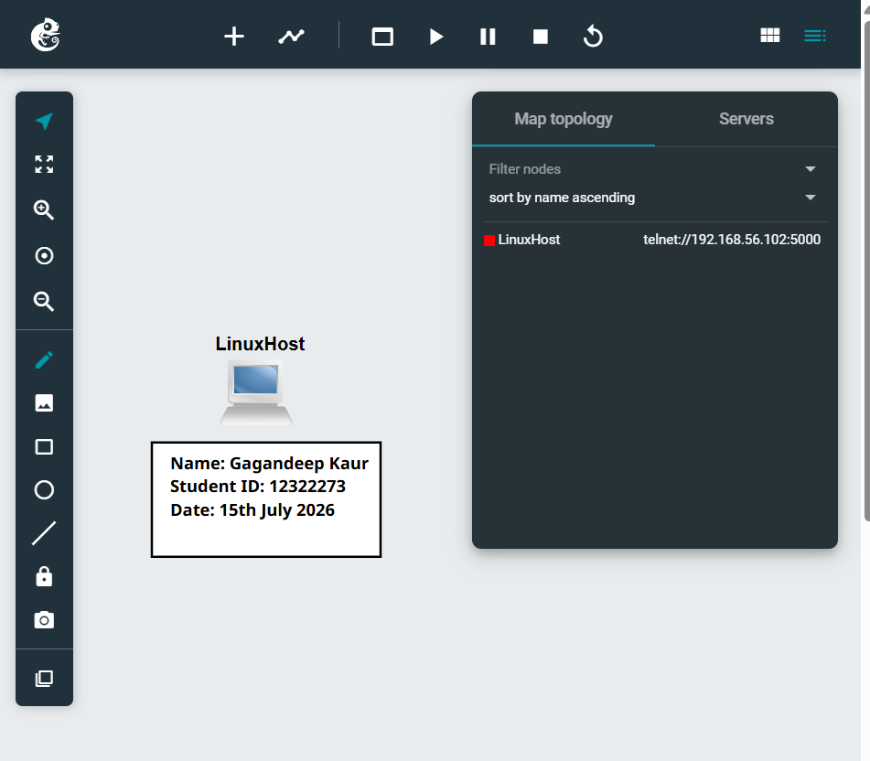
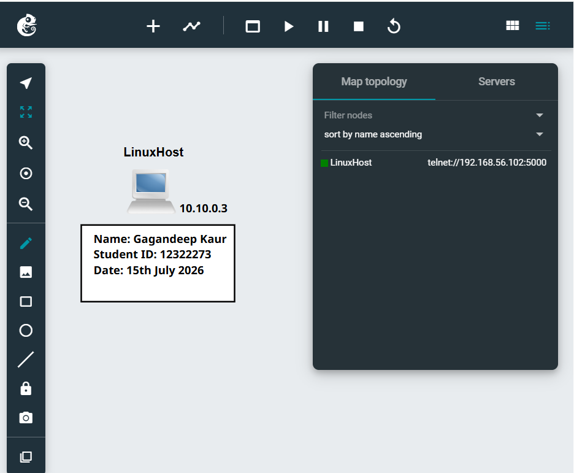
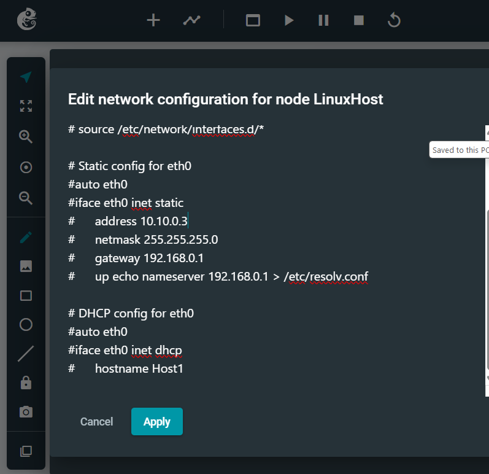
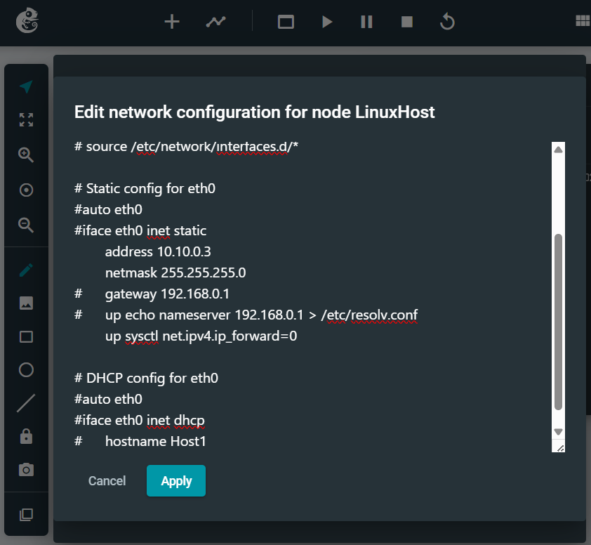
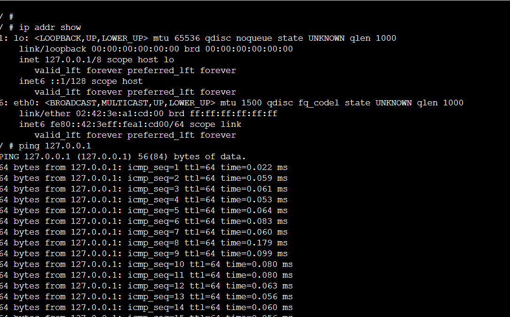

# Week 1 | Introduction to GNS3 Basics

## Brief Overview

This lab introduced the fundamentals of how to install and operate GNS3 as a network simulation environment. The objective is to create a Linux host, configure it with a static IP address and provide evidence that the configuration was successful with command-line tools. By the end, we run Linux commands in a console of web browser to get the results and information of network.

## Activity Breakdown and Evidence

### 1. Download and install GNS3.

      Download the GNS3 VM on the local computer and install it. After installation, I launched GNS3 using VirtualBox and accessed the interface of the virtual machine through the web browser using http://192.168.56.102/

      Here is the screenshot of installation: [GNS3 Installation](./images/week1-GNS3Running.png)
       Here is the screenshot of installation: [GNS3 Installation](./https://github.com/12322273-Magic/12322273-COIT20261-2026T2/blob/main/images/week1-LinuxHost.png)
                                          

### 2. Workspace Configuration

      I opened the workspace, and create the new project using my student ID. 
      After that, I add the single Linux Host Node, renamed it and labelled it with static IP Address.

      Below are the screenshots as a reference: 

      
   
### 3.  IP Address Configuration.

     Before starting the host, I went into the /etc/network/interfaces file and configured the network interface with the following static IP configuration:

    IP Address: 10.10.0.3
    Subnet Mask (/24): 255.255.255.0

    

    

    
   
### 4. Test and verify the configuration using command-line tools.

     To confirm the configuration was applied correctly, I opened a new terminal window on the Linux Host and used the command: ip address show

    The output confirmed that the host interface had been assigned with the correct IP address and subnet mask.

    
