## Week 2 - Static IP Addressing and Network Connectivity Testing

In Week 2, I configured a small Local Area Network (LAN) in GNS3 using four Linux hosts connected through an Ethernet switch.
The main purpose of this tutorial was to investigate different methods of assigning static IPv4 addresses to Linux hosts and to use the ping utility to test network connectivity, packet loss, and round-trip time (RTT).

Three different methods were used to configure static IP addresses:
GNS3 Configure menu.
Editing the Linux /etc/network/interfaces file.
Using the Linux ip address add command.

After configuring the hosts, I verified their IP addresses and tested communication between devices using different forms of the ping command.

### Task 1 - Setting Static IP Addresses

### AIM: 
The aim of this task was to configure static IPv4 addresses on four Linux hosts using three different configuration methods and compare how each method operates.

### Network Topology:

1.  4 × Linux Host nodes
2.  1 × Ethernet switch
3.  Ethernet connections between each host and the switch

All four hosts were part of the same LAN.

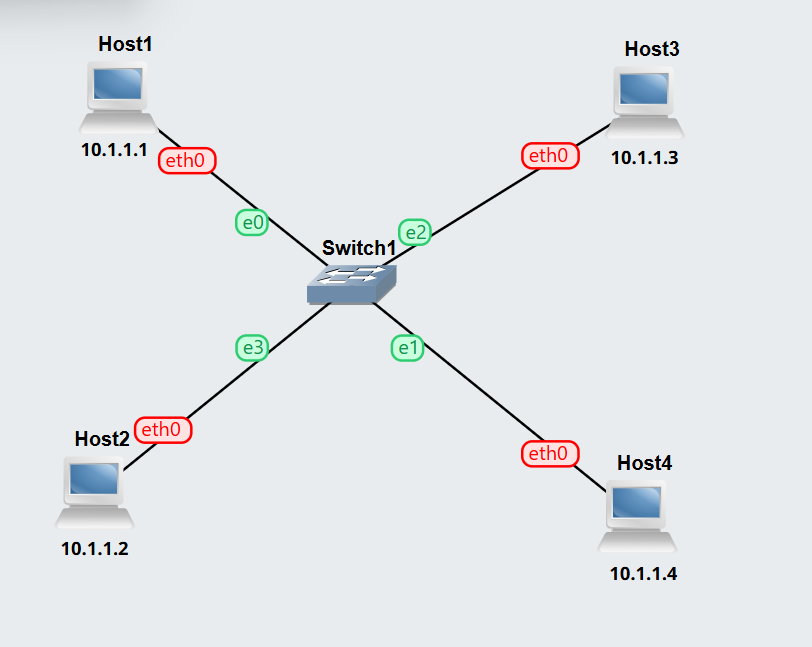

The following screenshot shows the completed GNS3 topology containing all four Linux hosts and the Ethernet switch.

## Configuring Host A and Host B Using GNS3

For the first two hosts, I configured the static IPv4 addresses through the GNS3 node configuration menu before starting the hosts.

The interface configuration followed this structure:

auto eth0
iface eth0 inet static
    address <IP-address>
    netmask <network-mask>

Once the configuration was saved, I started the nodes. This method applies the configuration when the Linux host starts.

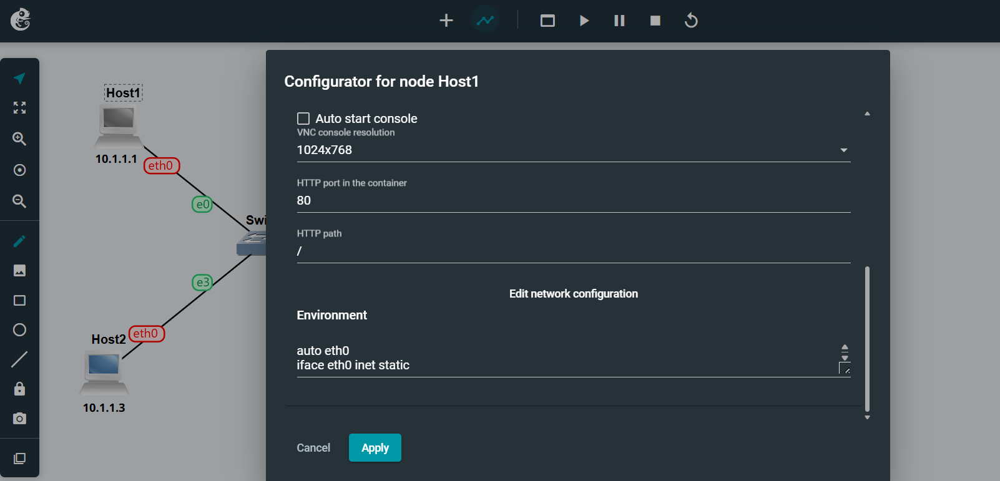

### Verifying Host A

I opened the console of Host A and entered:

ip address show

The output confirmed that the expected IPv4 address had been assigned to interface eth0.

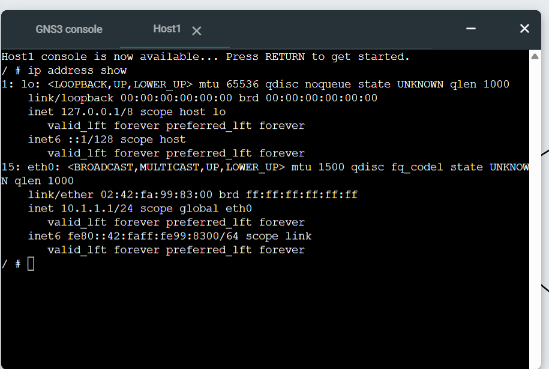

### I repeated the verification on Host B using:

ip address show
                                                                                                                                                                                                                                   
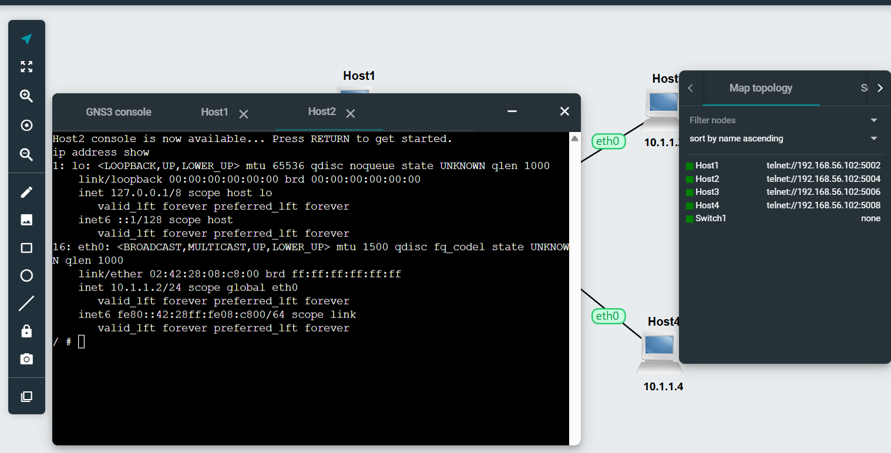

### Configuring Host C Using /etc/network/interfaces

For Host C, I configured the address manually from the Linux console.

I opened the configuration file using:

nano /etc/network/interfaces

I then added the static interface configuration:

auto eth0
iface eth0 inet static
    address <Host-C-IP>
    netmask <subnet-mask>

After saving the file, I reloaded the interface using:

ifdown eth0
ifup eth0

This step was important because changes made to /etc/network/interfaces after the host has already started are not automatically applied.

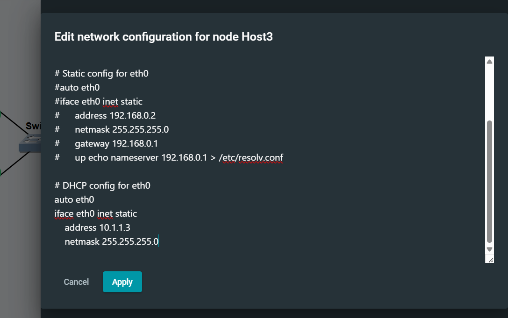

### Verifying Host C

I verified the configuration using:

ip address show

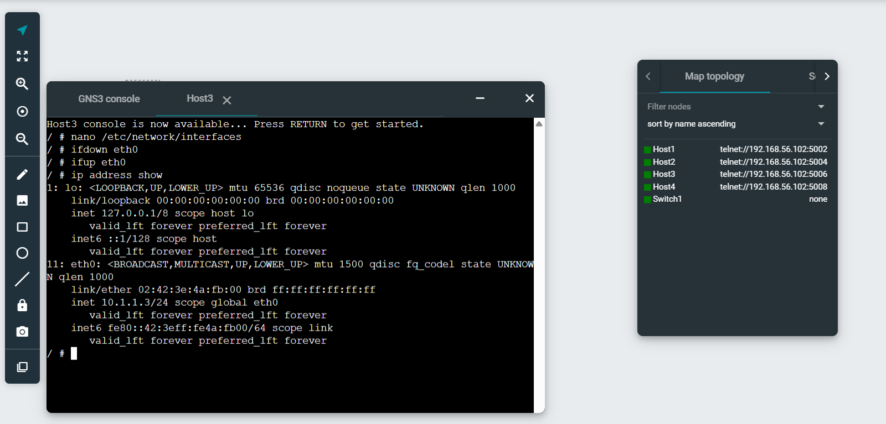

### Configuring Host D Using the ip Command

For Host D, I configured its IP address directly from the Linux command line.

The command used was:

ip address add <Host-D-IP>/<prefix> dev eth0

For example:

ip address add 10.1.1.4/24 dev eth0

Unlike editing /etc/network/interfaces, the address is applied immediately after executing the command.

### Verifying Host D

I entered:ip address show

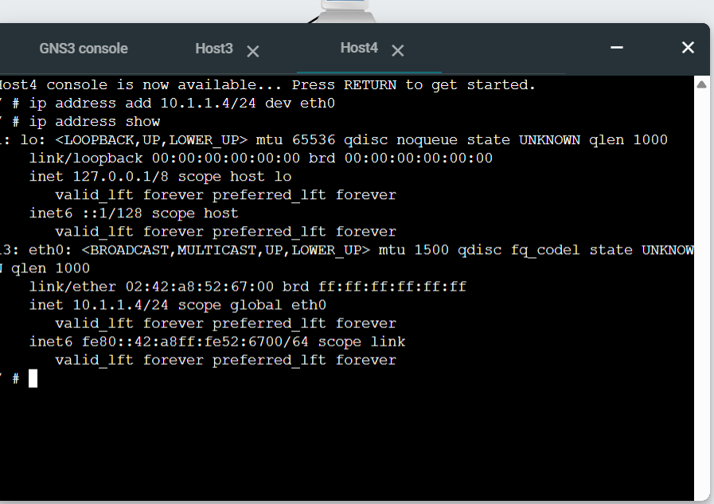

The required IPv4 address appeared on eth0, confirming that the command was successful.

An important difference is that an address configured using ip address add is temporary and is not maintained after the host is rebooted.

## TASK 2 - Testing Network Connectivity and Delay with Ping

### AIM:

The aim of Task 2 was to use the ping command to:

determine whether another host was reachable;
observe request and response communication;
examine packet loss;
measure round-trip time;
test different ping options.

### Basic Connectivity Test

I selected Host A as the source host and Host B as the destination.

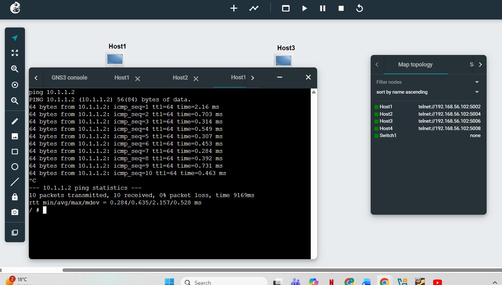

### Ping Test to an Incorrect IP Address

The next test involved attempting to communicate with an IP address that did not exist on my LAN.

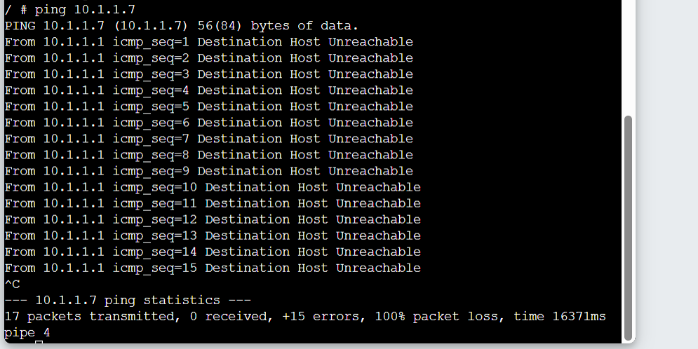

### Testing Ping Command Options

I then tested different command-line options to change how ping operated.

### Limiting the Number of Requests

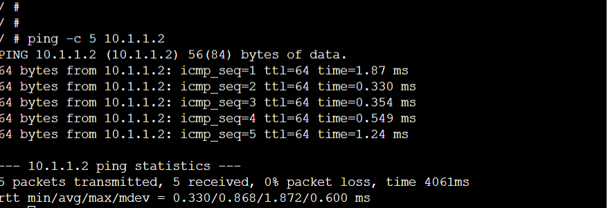

The -c 5 option limits the test to five requests instead of allowing ping to continue indefinitely.

### Changing the Interval

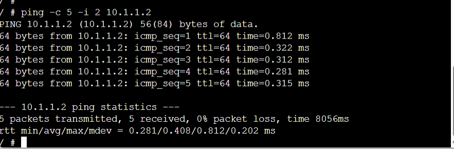

The -i 2 option changes the interval between requests to two seconds.

### Changing the Data Size

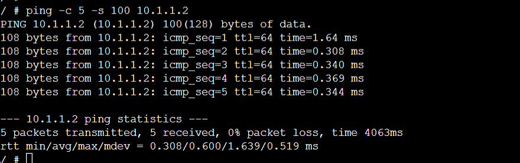

The -s 100 option changes the amount of data carried in the request to 100 bytes.

### Combining Options

I also tested multiple options together:

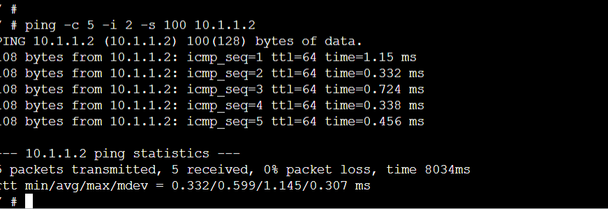

## Self Reflection

This week helped me improve my practical understanding of static IP addressing and basic network testing. By using different methods to configure IP addresses, I learned the difference between persistent and temporary network settings. The ping activities also helped me understand reachability, packet loss, and round-trip time. Overall, this tutorial improved my confidence in configuring, verifying, and troubleshooting a small network in GNS3.

