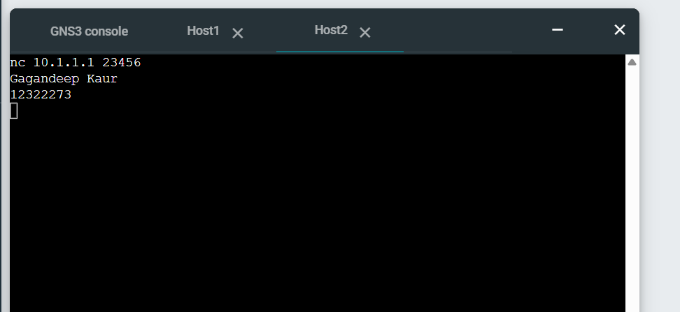
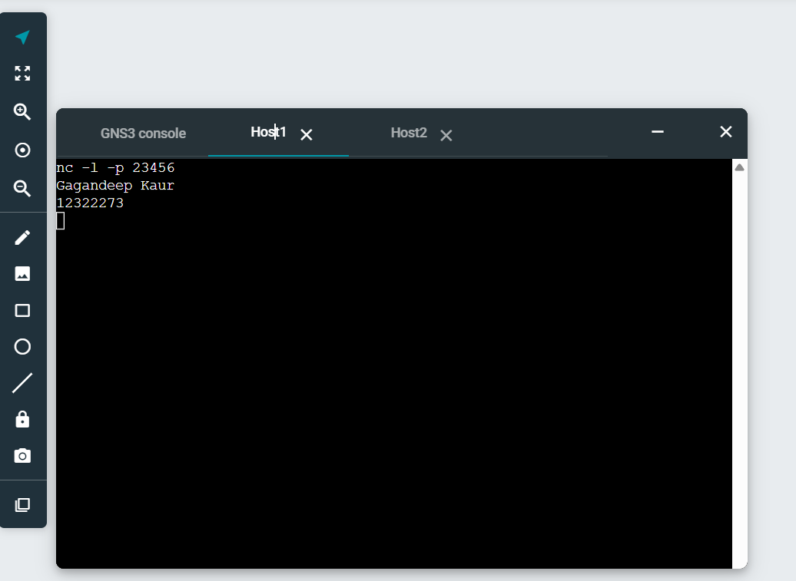
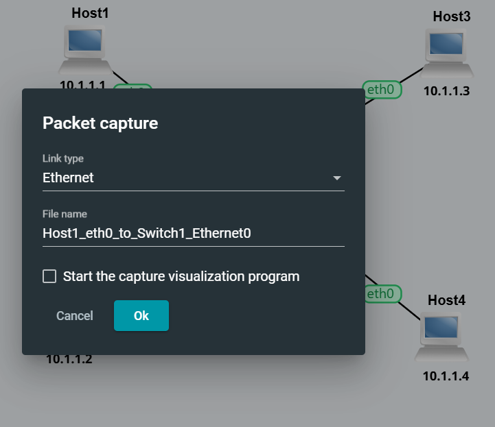

## Netcat Communication and Packet Capture

In Week 3, I explored simple application-level communication using Netcat and learned how to capture network packets in GNS3.

The tutorial consisted of two main tasks:

Establishing communication between two Linux hosts using Netcat.
Capturing ping and Netcat traffic on a network link and saving it as a .pcap file.

These activities helped me understand the difference between network-level connectivity testing using Ping and application-level communication using Netcat.

### Task 1 – Simple Application Communications with Netcat

### Aim:
The aim of this task was to learn how Netcat (nc) can be used as a simple client-server application for testing communication between two network hosts.

### Network Setup

I reused the GNS3 project created during Week 2: Setting-IP-12322273

The topology contained: Host A, Host B, Host C, Host D, Ethernet switch

All four Linux hosts had valid IPv4 addresses and were connected to the same LAN.

### Starting the Netcat Server

I selected one Linux host to act as the Netcat server.

nc 10.1.1.1 54321

The -l option places Netcat into listening mode, while -p specifies the port on which the server listens.

After running the command, the server waited for an incoming client connection.

### Exchanging Messages

After establishing the connection, I sent my name from the client to the server, i.e. Gagandeep Kaur

The message appeared successfully on the server console.I then sent my student ID from the server back to the client, i.e. 12322273.

The student ID appeared successfully on the client's console.

This demonstrated two-way communication between the Netcat client and server.

### I used the existing Week 2 topology and selected the link between:

Host A → Ethernet Switch.
I right-clicked the link and selected: Start capture. I selected Ethernet as the link type and started recording traffic.

Packet capture allows packets travelling across a network connection to be recorded for later inspection.

### Generating Ping Traffic

While the packet capture was running, I generated ICMP traffic by sending three ping requests from Host A to Host B.

For example: ping -c 3 10.1.1.2
The -c 3 option limited the ping test to three requests.

### Generating Netcat Traffic

I then used Netcat to generate application-level traffic between Host A and Host C. This traffic was also recorded by the running packet capture. After that, I stopped the Packet Capture.

### Packet Capture File

## Self-Reflection

This week helped me understand the difference between basic network connectivity and application-level communication. Using Netcat showed me how clients, servers, IP addresses and port numbers work together, while the packet capture activity introduced me to recording real network traffic for later analysis. I also learned that Ping and Netcat test different aspects of communication, so using both provides better information when troubleshooting network problems.
