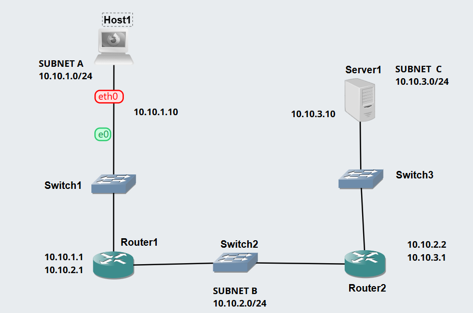
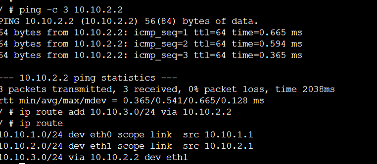
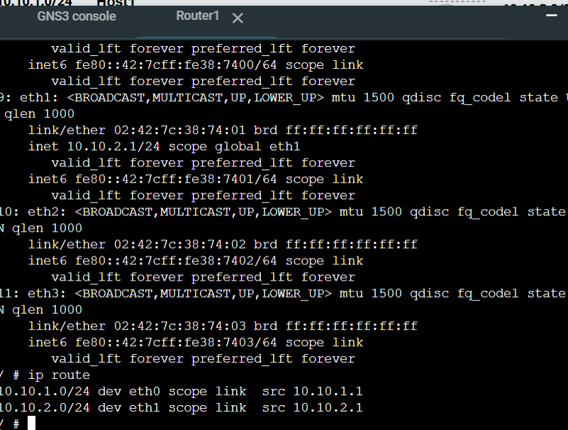
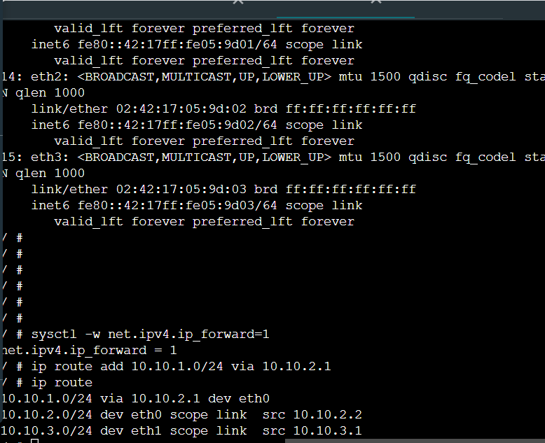
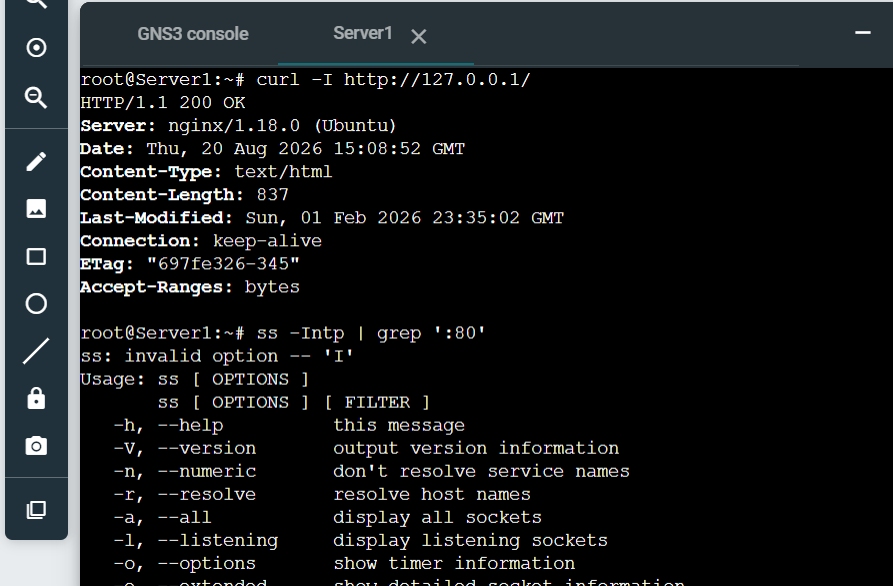
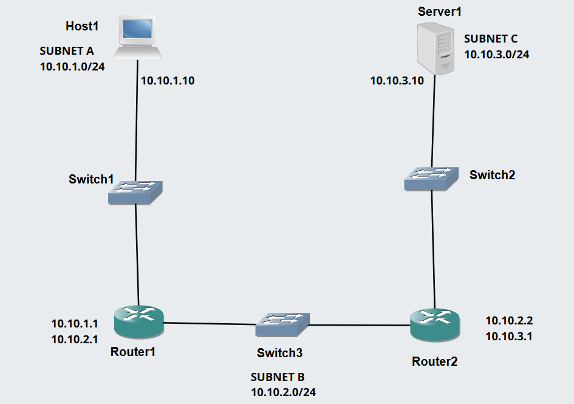
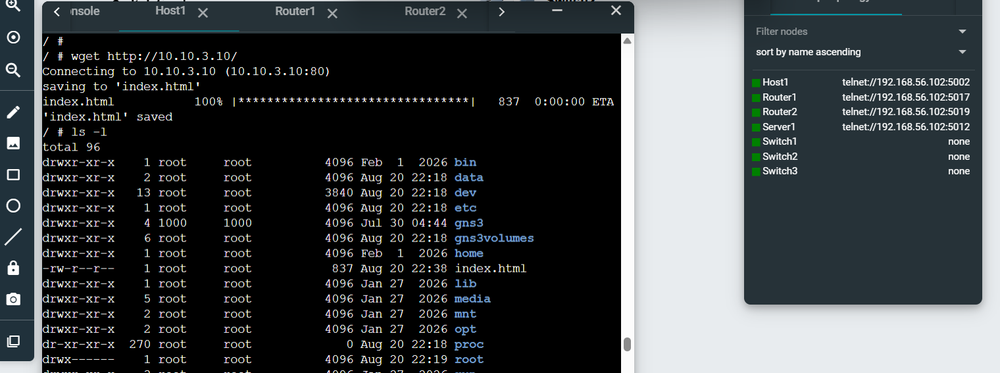
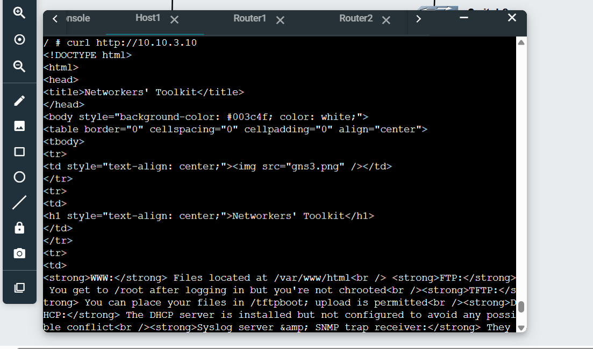

# HTTP Clients using GUI and CLI

In Week 4, I explored HTTP communication using both a graphical web browser and command-line HTTP clients. I created a multi-subnet network in GNS3 containing routers, switches, a Firefox client, and a Linux web server. I then tested HTTP access using Firefox, wget, and curl, while capturing packets between the routers. This activity helped me understand how HTTP traffic travels across multiple networks and how different client tools can be used to access a web server.

## Task 1 – HTTP Client with GUI

### AIM:
The aim of this task was to use Firefox as a graphical HTTP client to access a web server located on a different subnet and capture the HTTP traffic generated during the communication.

### Network Topology

The network contained three subnets:

Subnet A – Firefox Host, switch, and Router 1
Subnet B – switch connecting Router 1 and Router 2
Subnet C – Router 2, switch, and Linux Server

The topology allowed the Firefox client in Subnet A to communicate with the HTTP server located in Subnet C through both routers.

GUI GNS3 File: 

### Connectivity Testing

Before testing HTTP, I started all nodes and verified network connectivity using ping.

#### Router Configuration

Successful ping responses showed that IP addressing and routing were configured correctly before HTTP testing began.

### Starting the Packet Capture

I started a packet capture on a link in Subnet B, between Router 1 and Router 2.This location was useful because HTTP traffic travelling from the client in Subnet A to the server in Subnet C had to pass through Subnet B.

The capture file was saved as: HTTPClient-GUI-12322273-subnetB.pcap

### Accessing the Web Server using Firefox

I started the VNC/noVNC client for the Firefox Host.

Inside Firefox, I entered the IP address of the Linux Server: http://<server-IP>.I used a private browsing window to avoid cached content affecting the packet capture.
The web page loaded successfully.

## Task 2 – HTTP Client with Command Line Interface

### AIM:
The aim of Task 2 was to use command-line HTTP clients, particularly wget and curl, to access the same web server without using a graphical browser.

### Creating the CLI Project

I copied the previous project and renamed it:HTTPClient-CLI-1232273.

CLI GNS3 File: 

I removed the Firefox Host and replaced it with a Linux Host.The Linux Host was configured with the same IP address previously used by the Firefox Host.

### Accessing the Web Server using wget

I opened the console of the Linux Host and used: wget http://10.10.3.10/

The wget command requested the webpage from the HTTP server.

By default, the received webpage was saved locally, typically as:index.html.This occurs because requesting / normally causes the web server to return its default page.

### While running the wget test, I captured packets on the Subnet B link.

The capture was saved as:

HTTPClient-CLI-12322273-subnetB.pcap

This capture contains the HTTP traffic generated when the Linux Host requested the webpage using wget.

### Accessing the Web Server using curl

I then tested the server using curl.
curl http://10.10.3.10/

This displayed the returned webpage content directly in the terminal.

I could also save the output to a file using: curl -o page.html http://<server-IP10.10.3.10>/page.html.

### Self Reflection

This week helped me understand how HTTP communication works across multiple subnets and how routing and default gateways allow clients to reach servers on different networks. I also learned the difference between GUI-based and command-line HTTP clients by using Firefox, wget, and curl. The packet capture activity improved my understanding of how application traffic travels through routers, and overall this tutorial increased my confidence in configuring and troubleshooting multi-network communication in GNS3.

Unlike wget, curl commonly displays the received content directly unless an output file is specified.
