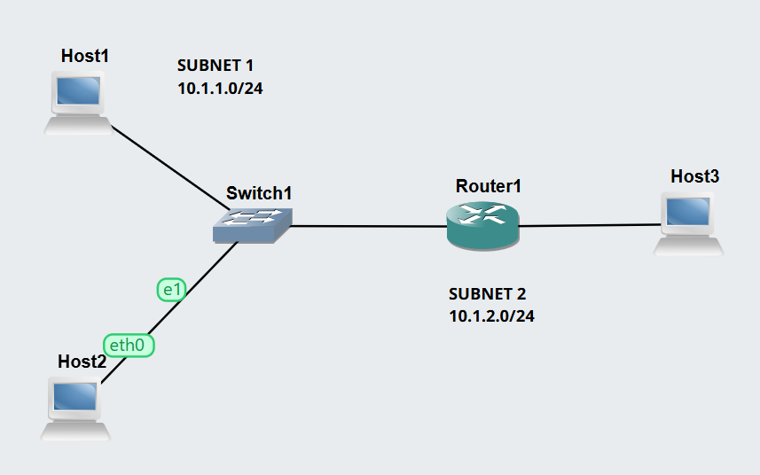
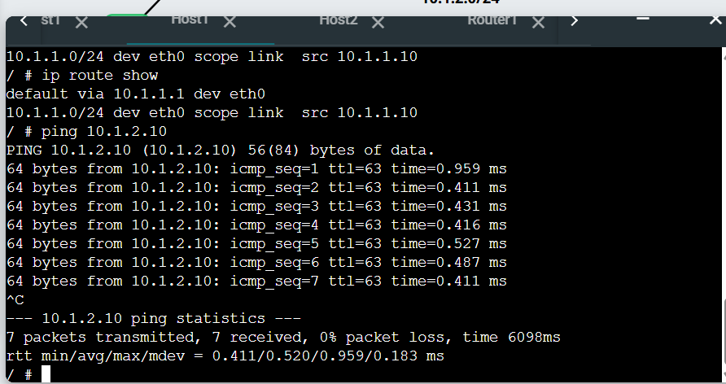
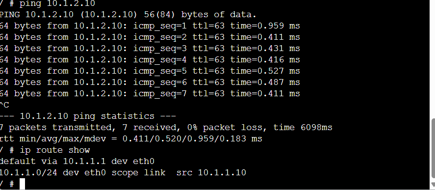
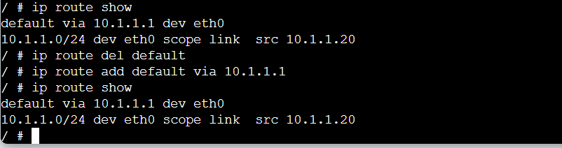
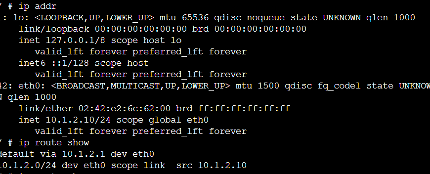
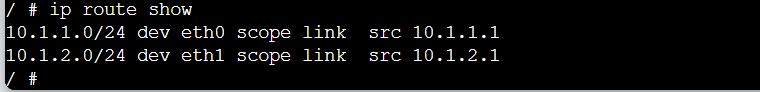
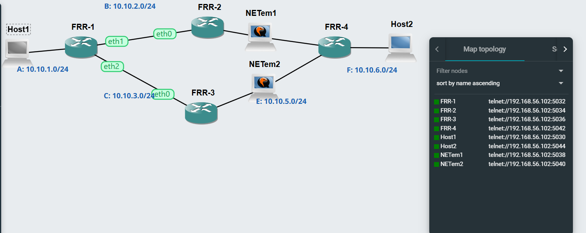

# Routing Tables and Dynamic Routing with OSPF

In Week 5, I learned how routing tables are used to forward packets between different subnets and how a Linux router can be configured to enable IP forwarding. I also explored dynamic routing using OSPF and observed how routers automatically adjust their routes when a network link becomes unavailable.

The tutorial consisted of two main tasks:
1. Viewing routing tables and enabling packet forwarding.
2. Observing dynamic routing behaviour using OSPF.

## Task 1 – View Routing Tables

### AIM: 
The aim of this task was to create a two-subnet network, configure a Linux router, enable packet forwarding, inspect routing tables, and test communication between hosts located on different networks.

### Network Topology

I created a GNS3 project named: View-Routes-12322273

The topology contained: Host A, Host B, Host C, Linux Router, Ethernet Switch.
Two different subnets: Host A and Host B were connected to the Ethernet switch, while Host C was directly connected to the second interface of the router.

### Enabling IP Forwarding

The router must be able to forward packets between the two networks.

I enabled forwarding using: sysctl net.ipv4.ip_forward=1

For the normal Linux hosts, forwarding was disabled: sysctl net.ipv4.ip_forward=0

A value of 1 means forwarding is enabled, while 0 means forwarding is disabled. 

### Viewing Routing Tables

I viewed the routing table on each device using: ip route show.
The routing table contains information about: Destination networks, Directly connected networks, Default gateway, Interface used to reach the destination

### Host A Routing Table

### Host B Routing Table

### Host C Routing Table

### Router Routing Table

### Successful Ping

## Task 2 – Dynamic Routing with OSPF

### AIM:
The aim of Task 2 was to observe how OSPF dynamically creates routing information and how it automatically responds when a network path becomes unavailable.

### OSPF Network Setup

I imported the provided OSPF GNS3 template and created my own copy.

The topology contained: Host 1, Host 2, FRR1, FRR2, FRR3, FRR4, NETem nodes, Multiple possible routes between the two hosts
The FRR routers were already configured with IPv4 addresses and OSPF.

### Accessing FRRouting

After starting the routers, I waited until the following prompt appeared: frr#.

### Viewing OSPF Neighbours

On FRR1, I entered: show ip ospf neighbor

This command displays routers that have formed OSPF neighbour relationships.

### Simulating a Link Failure

The network contains alternative paths between the hosts. To simulate a network failure, I stopped the appropriate NETem node on the path currently being used. Stopping the NETem node effectively disconnected that path.

## Self-Reflection

This week helped me understand how routers use routing tables and default gateways to forward traffic between different networks. I also learned how IP forwarding enables a Linux device to operate as a router. The OSPF activity was particularly useful because I could observe how the routing path automatically changed after a network link was disconnected. Using show ip route and traceroute also improved my ability to analyse and troubleshoot routing behaviour in GNS3.
